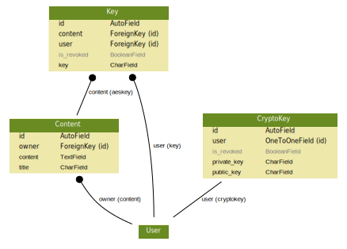

Models
======

The following image shows the data model. What is not shown are the supposed encryptions.

- ``Content.content`` is supposed to be encrypted with a symmetric cipher: **AES-256-CFB**.
- ``Key.key`` (initialization vector and key for above symmetric cipher) is supposed to be encrypted with an asymmetric ciper: **RSAES-OAEP**.
- ``CryptoKey.public_key`` is used for above asymmetric encryption.

.. automodule:: notes.models
    :members:
